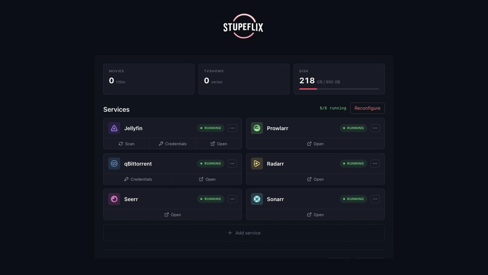
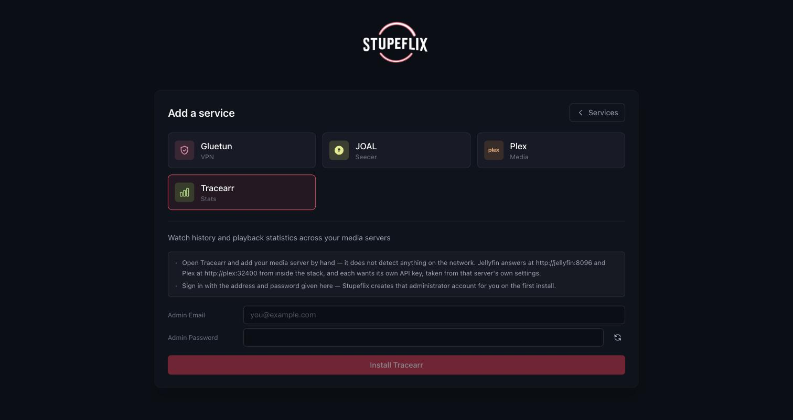
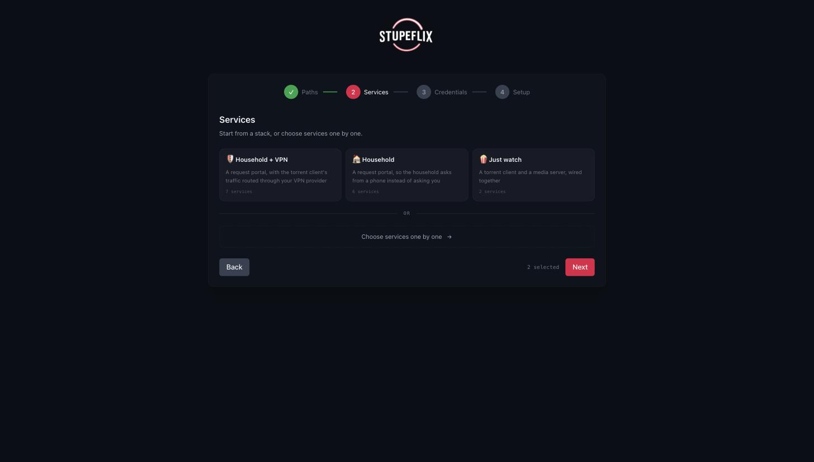
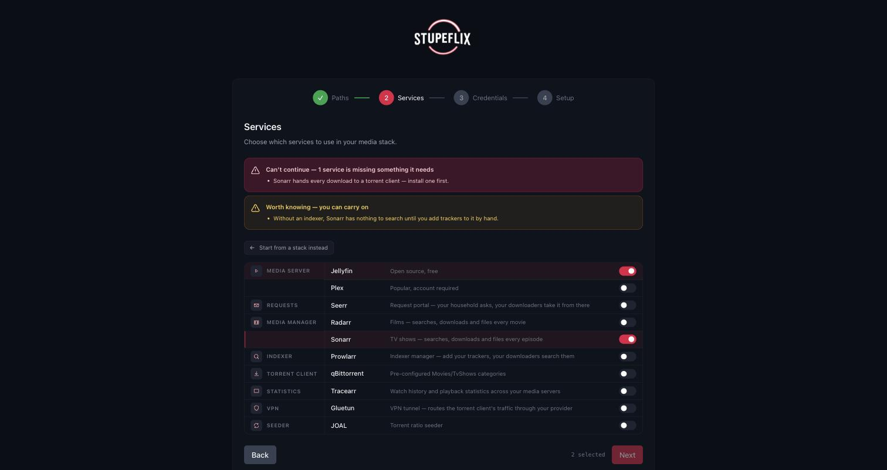

<div align="center">


**Self-hosted media server stack, installed and wired by a wizard.**

[](https://nodejs.org)
[](https://www.typescriptlang.org)
[](https://docs.docker.com/get-docker/)
[](https://pnpm.io)

[Getting started](#getting-started) •
[What's inside](#whats-inside) •
[Development](#development) •
[Reference](#reference)

</div>

---

Setting up a media server usually means writing a Compose file by hand, then clicking
through each service's own setup screen. Stupeflix does both: you pick the services, it
generates the Compose file, starts the containers on your Docker daemon and configures
each one through its own API — libraries created, keys exchanged, services pointed at
each other. Then it stays up as a dashboard.

Every service is a YAML file in [`templates/`](templates), loaded at runtime — no
service is named in the code. Adding one is dropping a `.yml` there, plus its
logo as `packages/web/src/icons/<id>.svg`; [dashboardicons.com](https://dashboardicons.com)
has a mark for every self-hosted app in this stack. Take the **monochrome**
variant and set `fill="currentColor"` on its root, so the icon picks up the
service's colour — a service with no icon still works, it just gets a plain
circle.

## What it looks like

| The dashboard | Adding a service |
|---|---|
|  |  |
| The stack once it is up, with what each service can do from here | Its own notes and credentials, read straight from the template |

| Stacks | Services |
|---|---|
|  |  |
| A set that works together, or pick services one by one | What a service needs blocks, what it merely likes only warns |

## Getting started

### Prerequisites

Docker with the Compose plugin, and a host directory for your config and media.

> [!IMPORTANT]
> That directory is mounted at the same path inside the container, so every path you set
> in the wizard must live under it.

### 1. Start it

```bash
cp .env.example .env          # optional: host path, PUID/PGID, timezone
docker compose up -d --build
```

| Mount | Why |
|-------|-----|
| `/var/run/docker.sock` | Drives the host Docker daemon to run your stack |
| `/srv/stupeflix` | Config and media, mounted at the same path inside |
| `stupeflix-data:/data` | SQLite database and the generated `docker-compose.yml` |

<details>
<summary>Without Compose (<code>docker run</code>)</summary>

```bash
docker build -t stupeflix .

docker run -d --name stupeflix \
  -p 3000:3000 \
  -v /var/run/docker.sock:/var/run/docker.sock \
  -v /srv/stupeflix:/srv/stupeflix \
  -v stupeflix-data:/data \
  --add-host=host.docker.internal:host-gateway \
  stupeflix
```

`--add-host` is Linux-only; Docker Desktop and OrbStack already provide
`host.docker.internal`. For another directory, change both sides of that mount and pass
`-e STUPEFLIX_ROOT=/your/path`.

</details>

### 2. Run the wizard

Open **http://localhost:3000** and go through four steps:

| Step | What you give it |
|------|------------------|
| **Paths** | Config, media and downloads directories, plus your libraries (name + type) |
| **Services** | A ready-made stack, or services one by one |
| **Credentials** | Usernames, passwords, provider keys — generated on request |
| **Setup** | Nothing: it writes the Compose file, boots the containers and configures them, one status line per step |

### 3. Manage it from the dashboard

A tile per library with its item count, a card per service with its status, readouts and
action buttons. Services are added, reconfigured and removed from there, one at a time.

### Configuration

[`.env`](.env.example) covers the common cases; the rest are environment variables on
the container.

| Variable | Default (image) | Description |
|----------|-----------------|-------------|
| `STUPEFLIX_ROOT` | `/srv/stupeflix` | Host directory mounted at the same path; prefills the wizard |
| `STUPEFLIX_SERVICE_HOST` | `host.docker.internal` | Host where the service containers publish their ports |
| `STUPEFLIX_DB_PATH` | `/data/stupeflix.db` | SQLite database |
| `STUPEFLIX_COMPOSE_FILE` | `/data/docker-compose.yml` | Generated compose file |
| `STUPEFLIX_COMPOSE_PROJECT` | `stupeflix` | Compose project name |
| `STUPEFLIX_TEMPLATES_DIR` | `/app/templates` | Service templates |
| `STUPEFLIX_STACKS_DIR` | `/app/stacks` | Shipped stacks; unset simply removes the fork in the wizard |
| `STUPEFLIX_TOKEN` | *(minted)* | Access token for the wizard and the API; left unset, one is minted on first boot and printed at startup |
| `PUID` / `PGID` | `1000` | Ownership applied to the service containers |
| `TZ` | `Europe/Paris` | Timezone handed to the service containers |
| `PORT` | `3000` | HTTP port (API + wizard) |
| `HOST` | `0.0.0.0` | Interface the server binds; `127.0.0.1` keeps it off the network |

> [!WARNING]
> Match `PUID`/`PGID` to the user owning `STUPEFLIX_ROOT`. A mismatch rewrites the
> compose file on every switch, recreating every container.

> [!TIP]
> **On Windows, run it from inside WSL 2** and keep `STUPEFLIX_ROOT` on the WSL 2
> filesystem, not under `/mnt/c/...` — the daemon resolves that path a second time when
> creating the service containers.

### Access token

Every API route except the healthcheck needs a bearer token, and the wizard asks for it
once. Unset, one is minted on first boot, kept in the database so it survives a restart,
and printed in the log:

```bash
docker logs stupeflix | grep 'Access token'
```

Set `STUPEFLIX_TOKEN` to pin your own instead — the minted one is then ignored. Driving
the API by hand means carrying it:

```bash
curl -H "Authorization: Bearer $STUPEFLIX_TOKEN" http://localhost:3000/api/status
```

### Remote access

Stupeflix and the services it starts are reachable on your own network only. Two
optional containers put them on a domain; neither starts unless you ask for it.

**Cloudflare Tunnel** (`--profile tunnel`) — an outbound connection to Cloudflare, so
nothing is opened on your router and the routing lives in Cloudflare's dashboard.

1. Create a [remotely-managed tunnel](https://developers.cloudflare.com/cloudflare-one/networks/connectors/cloudflare-tunnel/get-started/create-remote-tunnel/),
   copy its token into `CLOUDFLARE_TUNNEL_TOKEN` in `.env`.
2. Add one public hostname per service, pointing at `http://host.docker.internal:<port>`.
3. `docker compose --profile tunnel up -d`

**Nginx Proxy Manager** (`--profile proxy`) — a reverse proxy you host yourself: your
router forwards 80/443 to it, and it terminates TLS with Let's Encrypt certificates.

1. Uncomment 80 and 443 in [`docker-compose.yml`](docker-compose.yml), forward them on
   your router.
2. `docker compose --profile proxy up -d`
3. In its admin UI on `:81` ([first login](https://nginxproxymanager.com/setup/)), add
   one proxy host per subdomain, forwarding to `host.docker.internal:<port>`.

**Both** — point a single wildcard hostname `*.example.com` at `http://npm:80` in the tunnel:
80 and 443 stay closed on your router, and NPM handles every subdomain from there.

```bash
docker compose --profile proxy --profile tunnel up -d
```

**Before you point a hostname at anything:**

1. **Change NPM's first login**, and never route its `:81`. It is the thing that decides
   what gets published.
2. **Leave 80 and 443 commented out** while the tunnel is in front. Opening them puts an
   origin back on your IP, where a scanner finds it through its TLS certificate.
3. **Aim the wildcard at `http://npm:80` only.** Pointed at a service, it hands that one every
   subdomain you own.
4. **Give a proxy host to Jellyfin, Plex, Seerr or Stupeflix, and to nothing else.**
   Sonarr, Radarr and Prowlarr run with authentication disabled for local addresses and
   have no login to offer a stranger; they stay on the LAN.

## What's inside

### Services

What ships in `templates/` today.

| Service | Category | Port | Default | Needs |
|---------|----------|------|:---:|-------|
| [Jellyfin](templates/jellyfin.yml) | Media server | 8096 | **on** | — |
| [Plex](templates/plex.yml) | Media server | 32400 | off | — |
| [Seerr](templates/seerr.yml) | Request portal | 5055 | off | a media server |
| [Sonarr](templates/sonarr.yml) | Library manager (TV) | 8989 | off | a torrent client, an indexer |
| [Radarr](templates/radarr.yml) | Library manager (films) | 7878 | off | a torrent client, an indexer |
| [Prowlarr](templates/prowlarr.yml) | Indexer manager | 9696 | off | — |
| [qBittorrent](templates/qbittorrent.yml) | Torrent client | 8080 | **on** | — |
| [Gluetun](templates/gluetun.yml) | VPN tunnel | — | off | — |
| [JOAL](templates/joal.yml) | Seeder | 6060 | off | — |

### Stacks

Ready-made combinations, offered in the wizard's Services step. They live in
[`stacks/`](stacks).

| Stack | Services |
|-------|----------|
| Just watch | qBittorrent, Jellyfin |
| Automatic | + Prowlarr, Sonarr, Radarr |
| Household | + Seerr |
| Household + VPN | + Gluetun |

### How it works

```
templates/*.yml ─┐
                 ├─► registry ──► wizard ──► generated docker-compose.yml ──► compose up
stacks/*.yml ────┘                 │                                              │
                                   └────────► setup steps ◄───────────────────────┘
                                              (each service's own API)
```

1. Templates load at startup and become the services the wizard offers.
2. The wizard collects paths, the selection and credentials; declared secrets are minted
   once and kept across reconfigures.
3. The enabled templates' `compose:` blocks are merged into one file, VPN topology
   included.
4. `config_file` steps run, then `docker compose up -d`, then every other step.
5. Services are configured and pointed at each other over their own HTTP APIs.
6. The dashboard takes over, polling status and each template's readouts.

## Development

Node.js 22+ and pnpm on top of Docker.

```bash
pnpm install
pnpm dev             # API on :3000, wizard on :5173
```

Open **http://localhost:5173** — Vite proxies `/api` to the API on 3000.

| Command | Does |
|---------|------|
| `pnpm dev` | API + web in parallel (`dev:api` / `dev:web` for one) |
| `pnpm build` | Build both packages |
| `pnpm test` | Vitest, api package |
| `pnpm lint` | Biome: lint, format, import sorting. **The gate** |
| `pnpm clean` | Drop the build output (`dist/`) |
| `pnpm clean:state` | Also drop `data/` — database and generated compose file, so the wizard starts over. Take the stack down first |

### Project structure

```
stupeflix/
├── templates/          # Service definitions, loaded at runtime
├── stacks/             # Named sets of services
├── docs/templates.md   # How to write a template
├── packages/
│   ├── api/src/
│   │   ├── index.ts    # Loads templates, serves the API and the web build
│   │   ├── lib/        # Registry, setup runner, compose, network, requirements…
│   │   └── routes/     # setup, install, services, settings, docker
│   └── web/src/
│       ├── components/ # Wizard.tsx, Dashboard.tsx, steps/, dashboard/, ui/
│       ├── icons/      # One <service-id>.svg per service, found by filename
│       └── hooks/      # React Query hooks
└── data/               # SQLite DB + generated docker-compose.yml
```

### Tests

`pnpm test` runs Vitest over the engine, plus
[`templates.test.ts`](packages/api/src/templates.test.ts) against the **real**
`templates/`: every `{{...}}` resolves, `container_name` matches `container`, ports do
not collide, requirements name a category some template provides. **A new template must
keep it green.**

<details>
<summary>Docker-facing paths are not covered — test them on a throwaway stack</summary>

Never point this at your own stack: a reconfigure deletes generated configs.

```bash
mkdir -p /tmp/sfx/{config,media,torrents,data,templates}
for f in templates/*.yml; do
  sed -E 's/^([[:space:]]*container_name:[[:space:]]*)([A-Za-z0-9_-]+)$/\1\2-e2e/' \
    "$f" > "/tmp/sfx/templates/$(basename "$f")"
done

STUPEFLIX_TEMPLATES_DIR=/tmp/sfx/templates \
STUPEFLIX_DB_PATH=/tmp/sfx/data/stupeflix.db \
STUPEFLIX_COMPOSE_FILE=/tmp/sfx/data/docker-compose.yml \
STUPEFLIX_COMPOSE_PROJECT=stupeflix-e2e \
STUPEFLIX_TOKEN=e2e-token \
PORT=3999 pnpm --filter api dev
```

That starts the API alone, with the wizard nowhere in sight, so every route answers at
the root as well as under `/api`. Drive it with `POST /setup/complete` and poll
`GET /setup/status`, carrying the token on every call:

```bash
curl -H "Authorization: Bearer e2e-token" http://localhost:3999/setup/status
```

> [!WARNING]
> If you also remap a **port** to dodge a stack already running, move the service's
> own port with it — `WEBUI_PORT`, the port inside `config_file`, and the step URLs.
> Publishing `18080:8080` alone leaves the service listening on 8080 while the `Host`
> header says 18080, and qBittorrent (among others) refuses the request over it:
> `Invalid Host header, port mismatch`. It reads as a broken template and is not one.

</details>

## Reference

**[Writing a service template](docs/templates.md)** — the full YAML schema: setup steps,
requirements, networking, variables, `foreach`, actions and readouts.

**API** — every route is served under `/api`, and also at the root when the API serves
nothing else on the port (dev, where Vite strips the prefix when proxying). All of them
except `GET /health` need `Authorization: Bearer <token>`.

| Method | Endpoint | Description |
|--------|----------|-------------|
| `GET` | `/health` `/runtime` `/status` | Health, host wiring, setup state |
| `GET` | `/registry` `/stacks` `/templates` | What the wizard can offer |
| `POST` | `/templates/reload` `/templates/upload` | Reload from disk, add one |
| `POST` | `/setup/paths` `/setup/credentials` `/setup/services` | Store one wizard step |
| `POST` | `/setup/complete` | Start a full (re)configuration |
| `GET` | `/setup/status` `/credentials` | Progress, stored credentials |
| `GET` | `/services` `/services/:name/info` `/logs` | Status, readouts, logs |
| `POST` | `/install/:name` | Install one service (409 if a requirement is unmet) |
| `POST` | `/services/:name/reconfigure` | Reset its config and replay its setup |
| `DELETE` | `/services/:name` | Disable it and rewrite the compose file |
| `POST` | `/services/:name/start` `/stop` `/restart` | Container control |
| `POST` | `/services/:name/actions/:action` | Run an action a template declares |
| `GET` | `/library/stats` | Item count per library, plus disk usage |
| `POST` | `/docker/generate` `/up` `/down` `/pull` | Compose file and stack lifecycle |
| `GET` `PUT` `DELETE` | `/settings` `/settings/:key` | Stored settings |

**Stack** — Hono, sql.js and YAML templates on Node 22; React 19, Vite, TailwindCSS and
React Query in the wizard; pnpm workspaces, Vitest and Biome around them.

Design rules live in [CLAUDE.md](CLAUDE.md), contracts in [SPEC.md](SPEC.md).
